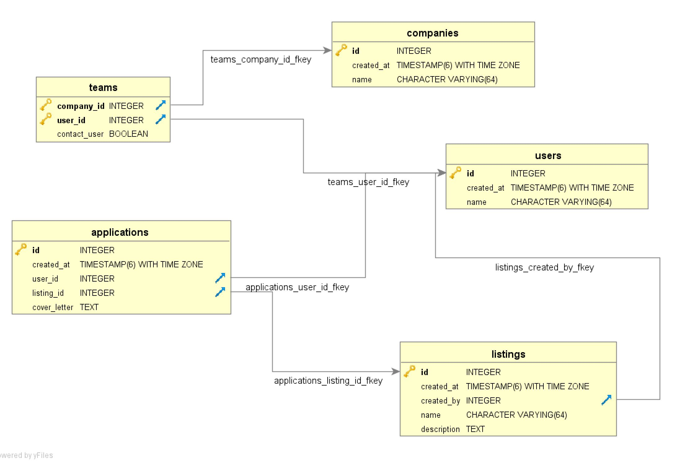

# Bookeeper

> An awesome NodeJs project to show my "ninja" coding skills 😎

## 💾 Installation

### Prerequisites

- Docker + Docker Compose (for production deployment)
- NodeJs 8.10 or above (for local development)
- Seed data (available [here](./docs/db/data.sql))

### Local Development

```bash
npm install

npm run build

npm run start:dev
```

### Production Deployment

To build the container image

```bash
npm run docker-build
```

To start the application

```bash
npm run up
```

To stop the application

```bash
npm run down
```

## 🎯 Aim of the project

To build Node API endpoints to query SQL data from postgres using advanced query features

## 🔗 API

### Get Top Active Users

```http request
GET /topActiveUsers?page={pageNumber}
```

```json
[
    {
        "id": 3,
        "name": "User 3",
        "createdAt": "2018-10-19T22:50:07.485Z",
        "count": "1",
        "listings": [
            "User 3 | Listing 4",
            "User 3 | Listing 5"
        ]
    },
    {
        "id": 2,
        "name": "User 2",
        "createdAt": "2018-09-19T16:50:07.485Z",
        "count": "1",
        "listings": [
            "User 2 | Listing 3"
        ]
    }
]
```

### Get Users Info

```http request
GET /users/?id={userId}
```

```json
{
    "id": 3,
    "name": "User 3",
    "createdAt": "2018-10-19T22:50:07.485Z",
    "applications": [
        {
            "id": 5,
            "createdAt": "2019-02-15T23:50:07.541Z",
            "coverLetter": "User 3 | Listing 2 | Application 5",
            "listing": {
                "id": 2,
                "name": "User 1 | Listing 2",
                "description": "Description 2"
            }
        }
    ],
    "companies": [
        {
            "id": 2,
            "name": "Company 2",
            "createdAt": "2018-04-26T21:50:07.490Z",
            "isContact": false
        }
    ],
    "createdListings": [
        {
            "id": 4,
            "name": "User 3 | Listing 4",
            "description": "Description 4",
            "createdAt": "2019-02-18T23:50:07.536Z"
        }
    ]
}
```

### DB ERD

DB Schema is available [here](./docs/db/structure.sql)

The sample database relationship is shown as follows:




### 🙇 Nerd Section

The project uses ES6/7 features such as `async/await`, `object destructuring` etc. which is not readily available in Node version 8 or below. 

Hence, there is a build step involved to transpile such features using Webpack and Babel. 

```bash
npm run build
```

Also, to stay alive as a sane Javascript developer, strict `eslint` rules are used. 

```bash
npm run lint
```

Finally, to ease the deployment process, `docker-compose` is used. 

```bash
docker-compose up
```
